```{r setup, include=FALSE}

knitr::opts_chunk$set(echo = FALSE, warning = FALSE, message = FALSE)

library(tidyverse)
library(ggridges)
library(haven)
library(plotly)
library(png)
library(knitr)

wide.df =  read_dta("Combined_Sandy_Harvey-Oct-08-2019-wide.dta")

wide.df = wide.df %>%
  filter(all_outliers == 0)

harvey = wide.df %>%
  filter(hurricane == 1) %>%
  filter(none == 0)

```

# Overview

* **Research Question:** Are businesses more/less resilient to certain infrastructure disruptions?
  * I.e., Are losses from some disruption types more/less avoidable?

* **Who cares?** 
  * Policy makers, city planners, disaster managers, individual firms

* **Data** 
  * Survey from firms affected by Hurricane Harvey

* **Contributions**
  * Resilience measurement 
  * Empirical framework to guide further research


---

# What is resilience?

* Ability of a system to absorb shocks
  * Focus on the **bounce-back** to normal or a "new" normal 

* Economic Resilience:
  * Focus on actions that occur after an event with the goal of reducing business interruptions (BI)
  * *Efficient* use of remaining resources

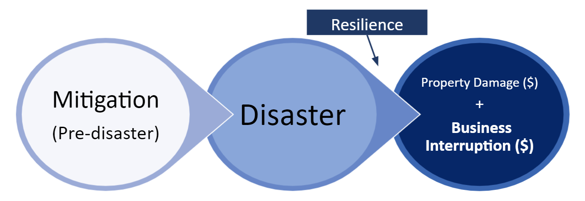

---

# Business Interruption (BI) versus Property Damage (PD)

* **September 11 World Trade Center Attacks**
  * PD: $25 billion
  * BI: $100 billion

* **Hurricane Katrina**
  * PD: $75 billion
  * BI: >$100 billion

* **ShakeOut San Andreas Fault Earthquake Simulation**
  * PD: $100 billion
  * BI: $68 billion

---

# Resilience Measurement

```{r, fig.retina=2}

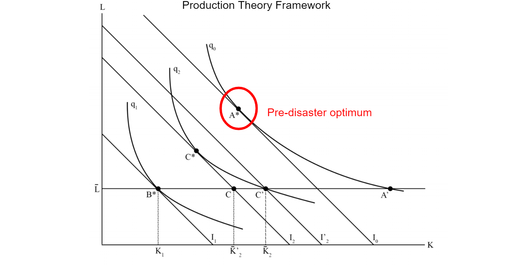

```

---

# Resilience Measurement

```{r, fig.retina=2}

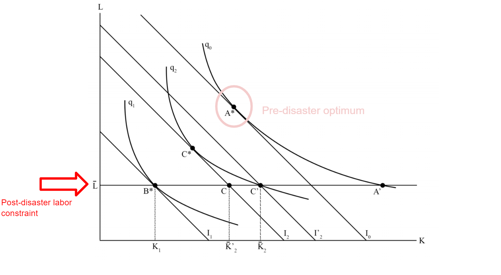

```

---

# Resilience Measurement

```{r, fig.retina=2}

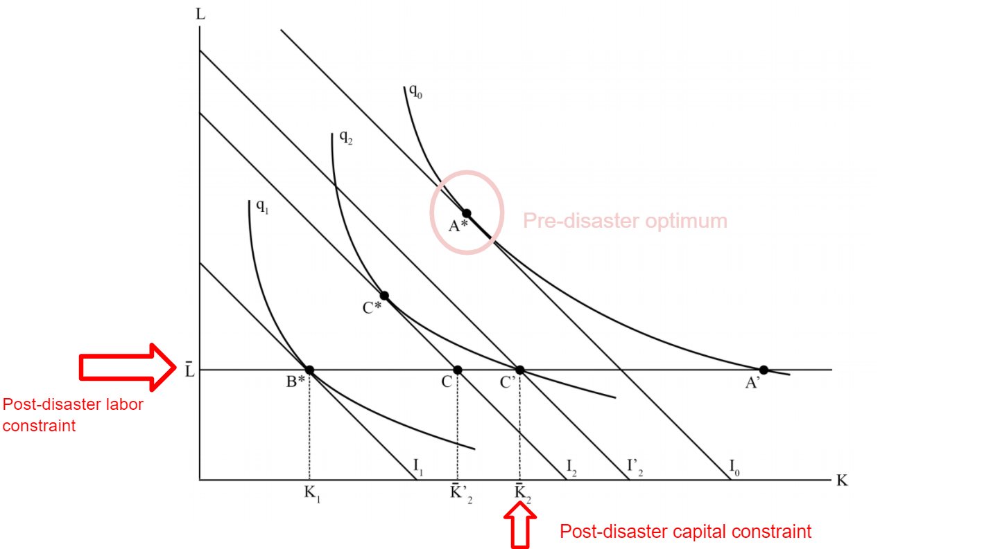

```

---

# Resilience Measurement

```{r, fig.retina=2}

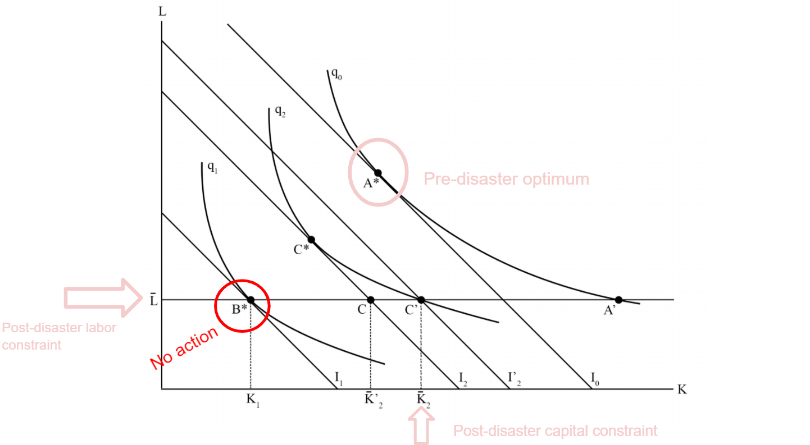

```

---

# Resilience Measurement

```{r, fig.retina=2}

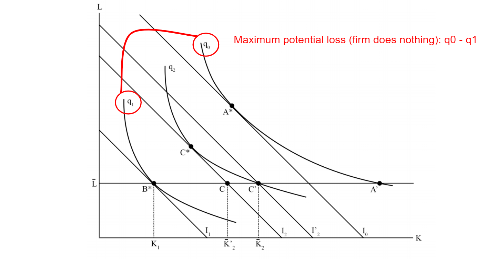

```

---

# Resilience Measurement

```{r, fig.retina=2}

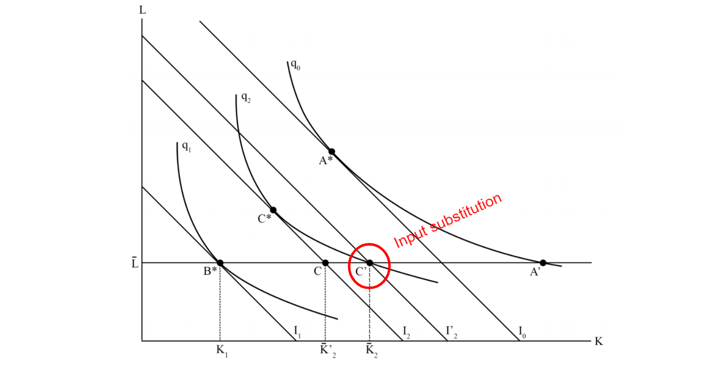

```

---

# Resilience Measurement

```{r, fig.retina=2}

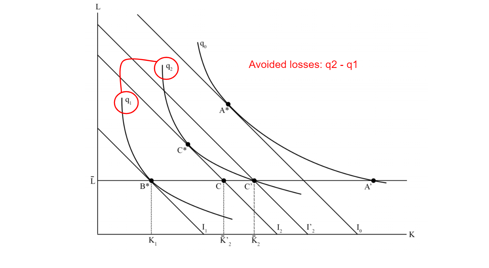

```

---

# Resilience Measurement

```{r, fig.retina=2}

include_graphics("h.png")

```

---

# Resilience Measurement

* Majority of studies use these observed losses ( $q_0 - q_2$ ) as a resilience metric

  * All else equal, a system with less observed losses is more resilient. However, the comparison only gives us a *marginal* resilience.
  
  * In other words, some rebounding has already occured.
  
  * Only looking at losses misses some of the rebound
  
  * **Percent lost sales revenue (SR) metric:**

$$\% LostSR = \frac{E[SR_{No Disaster}] - SR_{Observed}}{E[SR_{NoDisaster}]}$$
---

# Resilience Measurement

```{r, fig.retina=2}

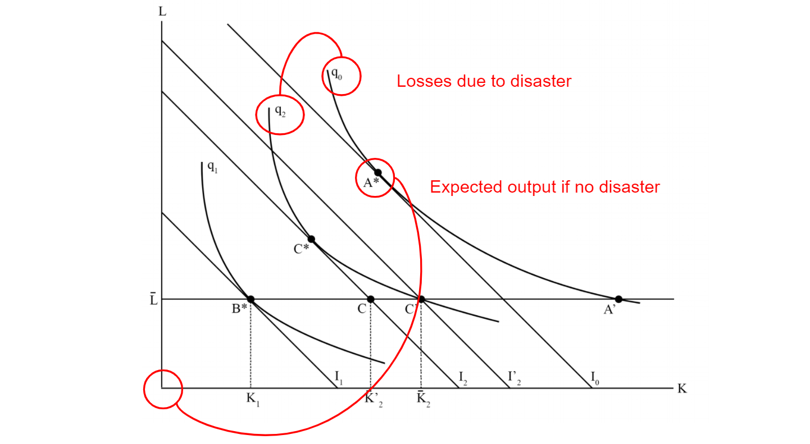

```

---

# Resilience Measurement

* Want a metric that captures the full rebound

* **Resilience Metric = Percent of maximum losses that were avoided:**

$$RM = \frac{AvoidedLosses}{MaxPotential}$$
---

# Resilience Measurement

```{r, fig.retina=2}

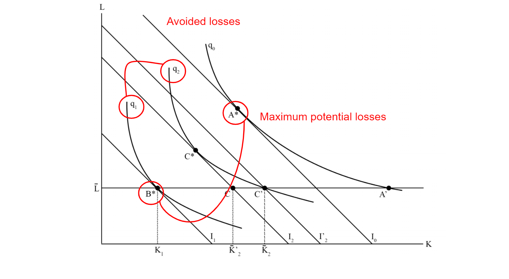

```

---

# Resilience Measurement

* Caveat: Not all RMs are equal

  * Treats firms with high potential losses the same as firms with low potential losses

* Can weight (**w**) by the percent of sales revenue at risk:

$$w = \frac{MaxPotential}{E[SR_{NoDisaster}]}$$

* $w=1$ when entire SR is at risk
* $w\to0$ when SR is not at risk

---

# Resilience Measurement

* Weighting the RM (**wRM**) yields: 

$$wRM = w*RM = \frac{MaxPotential}{NoDisasterSR} * \frac{AvoidedLosses}{MaxPotential} = \frac{AvoidedLosses}{NoDisasterSR}$$

---

# Resilience Measurement

```{r, fig.retina=2}

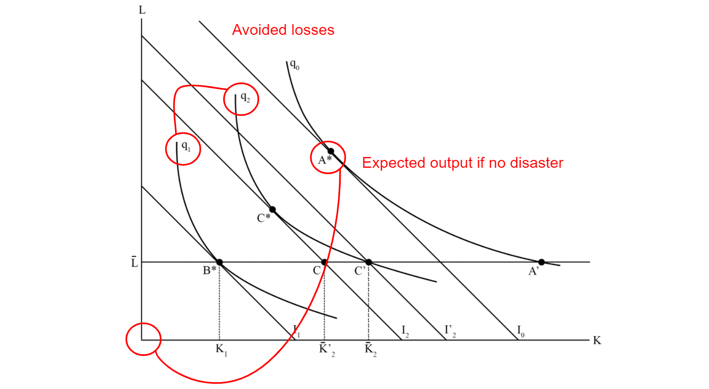

```

---

# Why the long-winded metric discussion?

* The research question: Are losses from some disruption types more/less avoidable?

* $wRM = 1$ is high bounce-back (losses are more avoidable).
* $wRM = 0$ is low bounce-back (losses are less avoidable). 

---

# Survey Data

* Maximum potential losses and expected sales revenue are not observed, need to be estimated
* Asked firms for their estimates of:
  * Expected sales revenue for the year after the hurricane
  * How much revenue was lost
  * What disruptions they faced
  * What actions, or tactics, they implemented to avoid business interruption
  * How much more they would have lost if no tactics were used
  
---

# Results

* 132 Responses

```{r, fig.width=11}

hdf = harvey %>%
  select(vrec, 
         title,
         exp_sales_annual_if_no_hurricane, 
         annual_lost_sales__percent, 
         avoided_losses_using_tactics, 
         months_to_recover,
         industry_codes) %>%
  mutate(ySR_loss = exp_sales_annual_if_no_hurricane * annual_lost_sales__percent / 100) %>%
  mutate(max_pot_loss = ySR_loss + avoided_losses_using_tactics) %>%
  mutate(RM = avoided_losses_using_tactics / max_pot_loss) %>%
  mutate(w = max_pot_loss / exp_sales_annual_if_no_hurricane) %>%
  mutate(w = ifelse(w > 1, 1, w)) %>%
  mutate(wRM = w * RM) %>%
  mutate(industry_codes = as.factor(industry_codes)) %>%
  mutate(title = as.factor(title))

hdf$industry_codes1 = hdf$industry_codes
levels(hdf$industry_codes1) = c("Agriculture, Mining,\nand Construction",
                                "Transportation, Communications,\nand Utilities",
                                "Manufacturing",
                                "Wholesale, Retail, Trade",
                                "Finance, Insurance,\nand Real Estate",
                                "Service Sector")

levels(hdf$title) = c("Owner",
                        "Partner",
                        "Chairperson",
                        "CEO",
                        "CFO",
                        "COO",
                        "Managing Director",
                        "President",
                        "Executive Vice President",
                        "Other C-Level",
                        "Other Company Officer",
                        "Principal",
                        "Other")

m = hdf %>%
  ggplot(aes(x = forcats::fct_rev(forcats::fct_infreq(title)))) +
  geom_bar(aes(fill = industry_codes1)) + 
  scale_fill_brewer(palette = "Paired", ) +
  theme_bw() +
  ylab("Count") +
  xlab("") +
  coord_flip() +
  labs(fill = "Industry Category") +
  ggtitle("Title of Respondents")

ggplotly(m)


```

---

## Results: Metric Disributions

```{r, dpi=300, fig.width=11}

hdf = harvey %>%
  select(vrec, 
         exp_sales_annual_if_no_hurricane, 
         annual_lost_sales__percent, 
         avoided_losses_using_tactics, 
         months_to_recover,
         industry_codes) %>%
  mutate(ySR_loss = exp_sales_annual_if_no_hurricane * annual_lost_sales__percent / 100) %>%
  mutate(max_pot_loss = ySR_loss + avoided_losses_using_tactics) %>%
  mutate(RM = avoided_losses_using_tactics / max_pot_loss) %>%
  mutate(w = max_pot_loss / exp_sales_annual_if_no_hurricane) %>%
  mutate(w = ifelse(w > 1, 1, w)) %>%
  mutate(wRM = w * RM) %>%
  mutate(industry_codes = as.factor(industry_codes))

hdf$industry_codes1 = hdf$industry_codes
levels(hdf$industry_codes1) = c("Agriculture, Mining,\nand Construction",
                               "Transportation, Communications,\nand Utilities",
                               "Manufacturing",
                               "Wholesale, Retail, Trade",
                               "Finance, Insurance,\nand Real Estate",
                               "Service Sector")


temp1 = hdf %>%
  mutate("Lost SR" = annual_lost_sales__percent / 100) %>%
  select(vrec,industry_codes1, w, RM, wRM, "Lost SR")

temp1 = temp1 %>%
  gather(key = "Metric", value = "Value", w:"Lost SR")

temp1$Metric = factor(temp1$Metric, levels = c("w", "RM", "wRM", "Lost SR"))

a = temp1 %>%
  ggplot(aes(x = Metric, y = Value)) +
  geom_boxplot(aes(fill = Metric)) +
  theme_bw() +
  ylab("") +
  xlab("") +
  facet_wrap(~industry_codes1) +
  theme(strip.background =element_rect(fill="black")) +
  theme(strip.text = element_text(colour = 'white')) +
  scale_fill_brewer()


a

```

---

## Results: Disruptions Contributing to Business Interruption, By Sector

```{r, dpi=300, fig.height=6, fig.width=11}

hdf = harvey %>%
  select(vrec, 
         exp_sales_annual_if_no_hurricane, 
         annual_lost_sales__percent, 
         avoided_losses_using_tactics, 
         months_to_recover,
         industry_codes,
         starts_with("bi", ignore.case = FALSE)) %>%
  mutate(ySR_loss = exp_sales_annual_if_no_hurricane * annual_lost_sales__percent / 100) %>%
  mutate(max_pot_loss = ySR_loss + avoided_losses_using_tactics) %>%
  mutate(RM = avoided_losses_using_tactics / max_pot_loss) %>%
  mutate(w = max_pot_loss / exp_sales_annual_if_no_hurricane) %>%
  mutate(w = ifelse(w > 1, 1, w)) %>%
  mutate(wRM = w * RM) %>%
  mutate(industry_codes = as.factor(industry_codes))

hdf$industry_codes1 = hdf$industry_codes
levels(hdf$industry_codes1) = c("Agriculture, Mining,\nand Construction",
                                "Transportation, Communications,\nand Utilities",
                                "Manufacturing",
                                "Wholesale, Retail, Trade",
                                "Finance, Insurance,\nand Real Estate",
                                "Service Sector")


hdff = hdf %>%
  gather(key = "BI", value = "Percent", bi_employees_unable_to_work:bi_facility_underwater)

hdff$BI = factor(hdff$BI)
levels(hdff$BI) = c("Communications", "Employees Moved", "Employees Can't Work", "Facility Underwater",
                    "Gas Outage", "Power Outage", "Supply Chain", "Transportation", "Water Outage")

b = hdff %>%
  filter(Percent != 0) %>%
  ggplot(aes(x = BI, y = Percent)) +
  geom_boxplot(aes(fill = BI)) +
  theme_bw() +
  theme(axis.text.x = element_text(angle = 65, hjust = 1, vjust = 1)) +
  theme(legend.position = "none") +
  facet_wrap(~industry_codes1) +
  xlab("Disruption Type") +
  theme(strip.background =element_rect(fill="black")) +
  theme(strip.text = element_text(colour = 'white')) +
  scale_fill_brewer()
  
b

```