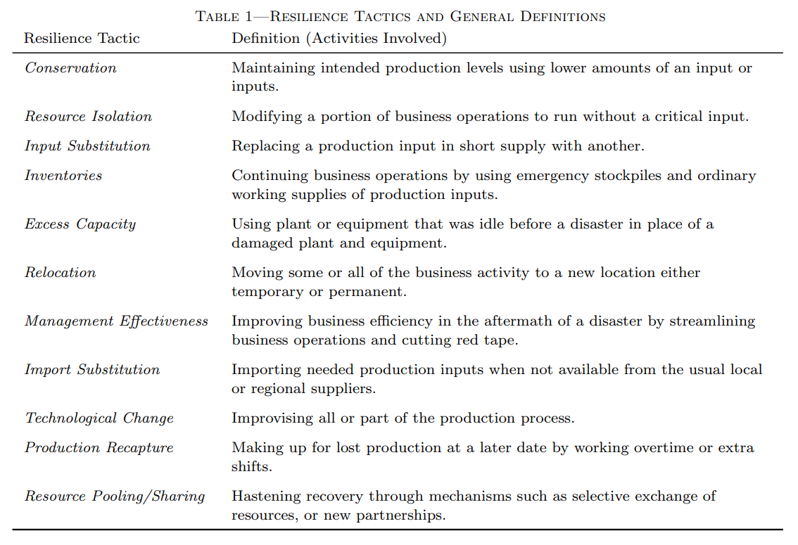

```{r setup, include=FALSE}

knitr::opts_chunk$set(echo = FALSE, warning = FALSE, message = FALSE)

library(tidyverse)
library(ggridges)
library(haven)
library(plotly)
library(png)
library(knitr)

wide.df =  read_dta("Combined_Sandy_Harvey-Oct-08-2019-wide.dta")

wide.df = wide.df %>%
  filter(all_outliers == 0)

harvey = wide.df %>%
  filter(hurricane == 1) %>%
  filter(none == 0)

```

# Overview

* **Research Question:** Are businesses more/less resilient to certain infrastructure disruptions?
  * I.e., Are losses from some disruption types more/less avoidable?

* **Who cares?** 
  * Policy makers, city planners, disaster managers, individual firms

* **Data** 
  * Survey from firms affected by Hurricane Harvey

* **Contributions**
  * Resilience measurement 
  * Empirical framework to guide further research

???

- Hi everyone, I'm Blain. Today I'll be presenting this working paper "Empirical Estimation of Economic Resilience to Infrastructure Disruptions"

- To jump right, our research question is: Are businesses more/less resilient to certain infrastructure disruptions? Or put another way: Are losses from some disruption types more/less avoidable?

- These sorts of questions are becoming more important as the disruptions from natural and man-made disasters continue to rise in scale and scope. In essence, policy makers, planners, disaster managers, firms, communities, etc. need more information on how to best optimize their disaster response / recovery plans. Understanding the nuanced responses by firms to critical infrastructure disruptions, for example which disruptions do firms seem to most struggle with, will help guide disaster planning strategies and responses. 

- To investigate this question, we surveyed firms affected by Hurricane Harvey, which was one of the most costly storms in recent history, about their experience and decisions in the aftermath of the storm.

- I hope this paper contributes to resilience measurement and helps lay the groundwork for further empirical research. 

---

# What is resilience?

* Ability of a system to absorb shocks
  * Focus on the **bounce-back** to normal or a "new" normal 

* Economic Resilience:
  * Focus on actions that occur after an event with the goal of reducing business interruptions (BI)
  * *Efficient* use of remaining resources


???

- I’ll quickly define our concept of resilience. A sort of common definition is that resilience is the ability of a system to absorb shocks and bounce back to normal or some “new normal”. There have been a lot of recent efforts to add specificity to the resilience definition and specificity to its measurement, and each academic field adopts its its own focus. So, when we talk about economic resilience, we are more focused on the efficient use of remaining resources after a shock. These actions, or tactics that businesses implement, occur after the disaster, and focus on reducing interruptions to the flows of goods and services in the economy.

- This is a slightly different focus than say engineering, which focuses more on mitigating risks pre-disaster, and is concerned with capital stocks and property damage. 


---

# Business Interruption (BI) versus Property Damage (PD)

* **September 11 World Trade Center Attacks**
  * PD: $25 billion
  * BI: $100 billion

* **Hurricane Katrina**
  * PD: $75 billion
  * BI: >$100 billion

* **ShakeOut San Andreas Fault Earthquake Simulation**
  * PD: $100 billion
  * BI: $68 billion

???

- Prior literature suggest that business interruption in the flows of goods and services is sizable, and can sometimes far exceed property damage to capital stock. For example, the estimated BI in the September 11th Attacks in the United States is estimated to be 4 times larger than property damage. For hurricane Katrina the ratio is more equal, in the ShakeOut earthquake simulation in California BI estimates are less. Despite this heterogeneity, it’s clear that these BIs are of significant magnitude. 

- Despite the large magnitude of BI, not a lot is known about the efforts that firms undertake to reduce BI. Keeping with the economic perspective, firms want to optimize their response so that they can avoided to most losses for the least cost. Where and how should they focus their efforts?

---

# Resilience Measurement

```{r, fig.retina=2}

include_graphics("a.png")

```

???

First, I'll do a quick walk through of the production theory framework that lays the foundation for our proposed metric for resilience. 

Starting with the theory: Here is simplified two-dimensional example, so some hypothetical firm produces outputs using some combination of capital and labor. Before the disaster they are assumed to be producing at their profit maximizing point A* which is the point of tangency between the isoquant q0 and the iscost I0. The firm is cruising along at its optimum but then is hit by a hurricane. 

---

# Resilience Measurement

```{r, fig.retina=2.5, out.width=650}

include_graphics("houston.jpg")

```

???

Here's a photo of downtown Houston after Harvey. Most employees are probably thinking that it might be a good week to call of work. 

---

# Resilience Measurement

```{r, fig.retina=2}

include_graphics("b.png")

```

???

This labor constraint is represented on the figure as a horizontal line, Lbar. 


---

# Resilience Measurement

```{r, fig.retina=2}

include_graphics("c.png")

```

???

In this example we are also imposing a capital constraint at Kbar. As you can see, these contraints prevent the firm from reaching its optimum output at A*.

---

# Resilience Measurement

```{r, fig.retina=2}

include_graphics("d.png")

```


???

In theory, if the firm were to continue its operations using the same pre disaster optimum ratio of labor to capital, but at the labor constraint, they would produce at B*. This can be thought of as the firm doing nothing. 

---

# Resilience Measurement

```{r, fig.retina=2}

include_graphics("e.png")

```


???

We identify the difference in quantities produced at A* and B* to be the maximum potential losses.

---

# Resilience Measurement

```{r, fig.retina=2}

include_graphics("f.png")

```

???

However, the firm can reach a higher output by substituting capital for labor. Here they are shifting away from there pre-disaster optimum ratio. Whereas before the disaster they could have produced this quantity q2 at price I2, now they produce at a higher cost I2’.


---

# Resilience Measurement

```{r, fig.retina=2}

include_graphics("g.png")

```


???

Lastly, we can see that by moving to q2, the firm is able to avoid some losses in revenue. This difference between the output they end up at using substitution, and the output they would have been at had they taken no action at all, is identified as the amount of avoided losses.


---

# Resilience Measurement

```{r, fig.retina=2}

include_graphics("h.png")

```

???

The difference between the A* and C* quantities are the losses due to the disaster.

---

# Resilience Measurement

* Majority of studies use these observed losses ( $q_0 - q_2$ ) as a resilience metric

  * All else equal, a system with less observed losses is more resilient. However, the comparison only gives us a *marginal* resilience.
  
  * In other words, some rebounding or bounceback has already occured 
  
  * Only looking at output or sales revenue losses misses some of the avoided losses
  
  * **Percent lost sales revenue (SR) metric:**

$$\% LostSR = \frac{E[SR_{No Disaster}] - SR_{Observed}}{E[SR_{NoDisaster}]}$$

???

- Quick pause: A majority of studies employ some form of observed losses in their resilience metrics. While useful, narrowing the focus to lost SR or lost output may miss or underestimate the "rebounding" that has occured, which is the heart of the concept of resilience.

- In percentage terms, a lost sales revenue metric could take the form shown here. Where the percent lost sales revenue due to the disaster equals the expected revenue if the disaster didn't occur minus the observed SR, divided by the expected revenue.


---

# Resilience Measurement

```{r, fig.retina=2}

include_graphics("i.png")

```

???

Or visually, its the losses due to the disaster divided by the expected revenue. 


---

# Resilience Measurement

* Want a metric that captures the full rebound

* **Resilience Metric = Percent of maximum losses that were avoided:**

$$RM = \frac{AvoidedLosses}{MaxPotential}$$

???

We want a metric that captures the full rebound. As a starting point, we define the "resilience metric" as the avoided losses divided by the Maximum Potential Losses faced by the firm. 

---

# Resilience Measurement

```{r, fig.retina=2}

include_graphics("j.png")

```

???

Which visually are these quantities here. 

---

# Resilience Measurement

* Caveat: Not all RMs are equal

  * Treats firms with high potential losses the same as firms with low potential losses

* Can weight (**w**) by the percent of sales revenue at risk:

$$w = \frac{MaxPotential}{E[SR_{NoDisaster}]}$$

* $w=1$ when entire SR is at risk
* $w\to0$ when SR is not at risk

???

- However, the RM is a bit coarse in that it doesn't account for the amount of potential losses at stake. For example, it doesn't differentiate between a firm whose entire revenue is at risk versus a firm whose only faces a minor potential loss.

- To account for this, we can weight the RM by the percent of sales revenue at risk. w equals 1 if the entire sales revenue is at risk and equals 0 if no revenue is at risk.

---

# Resilience Measurement

* Weighting the RM (**wRM**) yields: 

$$wRM = w*RM = \frac{MaxPotential}{E[SR_{NoDisaster}]} * \frac{AvoidedLosses}{MaxPotential} = \frac{AvoidedLosses}{E[SR_{NoDisaster}]}$$

- Weighting the RM yields our proposed metric, wRM, which is the Avoided Losses divided by the expected sales revenue had there been no disaster.

---

# Resilience Measurement

```{r, fig.retina=2}

include_graphics("k.png")

```

???

Again visually, it is these quantities here. 

---

# Why the long-winded metric discussion?

* The research question: Are losses from some disruption types more/less avoidable?

* $wRM = 1$ is high bounce-back (losses are more avoidable).
* $wRM = 0$ is low bounce-back (losses are less avoidable). 

???

Thus, we now have constructed a metric that allows us to investigate the research question. The weighted RM equals one when a firms entire revenue was at stake and it was able to avoid all potential losses. It equals zero when the firm isn't able to avoid any losses. 

---

# Survey Data

* Maximum potential losses and expected sales revenue are not observed, need to be estimated
* Asked firms for their estimates of:
  * Expected sales revenue for the year after the hurricane
  * How much revenue was lost
  * What disruptions they faced
  * What actions, or tactics, they implemented to avoid business interruption
  * How much more they would have lost if no tactics were used
  
???

- Expected sales revenue and, in particular, maximum potential losses are not directly observed and need to be estimated. Some researchers have used forecasting or matching to create the counterfactual for the sales revenue had the disaster not occured. Estimating the theorhetical maximum potential loss is a bit more difficult. Input output approach is one method. Here, we've opted to simply ask financial decision makers for their estimate. 

- Surveys were administered by a professional survey firm. Respondents were compensated about $60. They were about their expected sales revenue for the year, had the hurricane not happened, how much revenue was lost, what business disruptions did they face, what actions, or tactics, did they implement to avoid business interruption, and estimate how much worse off they would have been had they not used any tactics.  

---

## Results: Count of Responses, By Job Title

* 132 Responses

```{r, fig.width=11, dpi = 400}

hdf = harvey %>%
  select(vrec, 
         title,
         exp_sales_annual_if_no_hurricane, 
         annual_lost_sales__percent, 
         avoided_losses_using_tactics, 
         months_to_recover,
         industry_codes) %>%
  mutate(ySR_loss = exp_sales_annual_if_no_hurricane * annual_lost_sales__percent / 100) %>%
  mutate(max_pot_loss = ySR_loss + avoided_losses_using_tactics) %>%
  mutate(RM = avoided_losses_using_tactics / max_pot_loss) %>%
  mutate(w = max_pot_loss / exp_sales_annual_if_no_hurricane) %>%
  mutate(w = ifelse(w > 1, 1, w)) %>%
  mutate(wRM = w * RM) %>%
  mutate(industry_codes = as.factor(industry_codes)) %>%
  mutate(title = as.factor(title))

hdf$industry_codes1 = hdf$industry_codes
levels(hdf$industry_codes1) = c("Agriculture, Mining,\nand Construction",
                                "Transportation, Communications,\nand Utilities",
                                "Manufacturing",
                                "Wholesale, Retail, Trade",
                                "Finance, Insurance,\nand Real Estate",
                                "Service Sector")

levels(hdf$title) = c("Owner",
                        "Partner",
                        "Chairperson",
                        "CEO",
                        "CFO",
                        "COO",
                        "Managing Director",
                        "President",
                        "Executive Vice President",
                        "Other C-Level",
                        "Other Company Officer",
                        "Principal",
                        "Other")

m = hdf %>%
  ggplot(aes(x = forcats::fct_rev(forcats::fct_infreq(title)))) +
  geom_bar(aes(fill = industry_codes1)) + 
  scale_fill_brewer(palette = "Paired", ) +
  theme_bw() +
  ylab("Count") +
  xlab("") +
  coord_flip() +
  labs(fill = "Industry Category") 

m


```

???

We received 132 responses with a response rate of about 21\%. Surveys were administered about 13 months after Harvey.A majority of businesses that responded were in the service sector. Owners, managing directors, and CEOs were the top three titles of respondents (self reported).


---

## Results: Metric Disributions, by Sector

```{r, dpi=400, fig.width=11}

hdf = harvey %>%
  select(vrec, 
         exp_sales_annual_if_no_hurricane, 
         annual_lost_sales__percent, 
         avoided_losses_using_tactics, 
         months_to_recover,
         industry_codes) %>%
  mutate(ySR_loss = exp_sales_annual_if_no_hurricane * annual_lost_sales__percent / 100) %>%
  mutate(max_pot_loss = ySR_loss + avoided_losses_using_tactics) %>%
  mutate(RM = avoided_losses_using_tactics / max_pot_loss) %>%
  mutate(w = max_pot_loss / exp_sales_annual_if_no_hurricane) %>%
  mutate(w = ifelse(w > 1, 1, w)) %>%
  mutate(wRM = w * RM) %>%
  mutate(industry_codes = as.factor(industry_codes))

hdf$industry_codes1 = hdf$industry_codes
levels(hdf$industry_codes1) = c("Agriculture, Mining,\nand Construction",
                               "Transportation, Communications,\nand Utilities",
                               "Manufacturing",
                               "Wholesale, Retail, Trade",
                               "Finance, Insurance,\nand Real Estate",
                               "Service Sector")


temp1 = hdf %>%
  mutate("Lost SR" = annual_lost_sales__percent / 100) %>%
  select(vrec,industry_codes1, w, RM, wRM, "Lost SR")

temp1 = temp1 %>%
  gather(key = "Metric", value = "Value", w:"Lost SR")

temp1$Metric = factor(temp1$Metric, levels = c("w", "RM", "wRM", "Lost SR"))

a = temp1 %>%
  ggplot(aes(x = Metric, y = Value)) +
  geom_boxplot(aes(fill = Metric)) +
  theme_bw() +
  ylab("") +
  xlab("") +
  facet_wrap(~industry_codes1) +
  theme(strip.background =element_rect(fill="black")) +
  theme(strip.text = element_text(colour = 'white')) +
  scale_fill_brewer()


a

```

???

- Here are a bunch of boxplots, which show the different metrics outlined earlier. The light blue box is the weight, w, or the amount of sales revenue at risk. The RM is the percent of maximum potential losses that were avoided. The wRM is the product of the two. And lost sales revenue, or SR, is the percentage of annual sales revenue lost.  

- Between most sectors, there's not an obvious difference in the pattern of these metrics. We see from the w plots that revenue at risk ranged from very little to almost 100%. Generally, RMs and wRM are pretty low. The Finance, Insurance, and Real Estate sector seems to have been the least disrupted in terms of lost SR and revenue at risk.  

---

## Results: Disruptions Contributing to Business Interruption, By Sector

```{r, dpi=400, fig.height=6.8, fig.width=11}

hdf = harvey %>%
  select(vrec, 
         exp_sales_annual_if_no_hurricane, 
         annual_lost_sales__percent, 
         avoided_losses_using_tactics, 
         months_to_recover,
         industry_codes,
         starts_with("bi", ignore.case = FALSE)) %>%
  mutate(ySR_loss = exp_sales_annual_if_no_hurricane * annual_lost_sales__percent / 100) %>%
  mutate(max_pot_loss = ySR_loss + avoided_losses_using_tactics) %>%
  mutate(RM = avoided_losses_using_tactics / max_pot_loss) %>%
  mutate(w = max_pot_loss / exp_sales_annual_if_no_hurricane) %>%
  mutate(w = ifelse(w > 1, 1, w)) %>%
  mutate(wRM = w * RM) %>%
  mutate(industry_codes = as.factor(industry_codes))

hdf$industry_codes1 = hdf$industry_codes
levels(hdf$industry_codes1) = c("Agriculture, Mining,\nand Construction",
                                "Transportation, Communications,\nand Utilities",
                                "Manufacturing",
                                "Wholesale, Retail, Trade",
                                "Finance, Insurance,\nand Real Estate",
                                "Service Sector")


hdff = hdf %>%
  gather(key = "BI", value = "Percent", bi_employees_unable_to_work:bi_facility_underwater)

hdff$BI = factor(hdff$BI)
levels(hdff$BI) = c("Communications", "Employees Moved", "Employees Can't Work", "Facility Underwater",
                    "Gas Outage", "Power Outage", "Supply Chain", "Transportation", "Water Outage")

b = hdff %>%
  filter(Percent != 0) %>%
  ggplot(aes(x = BI, y = Percent)) +
  geom_boxplot(aes(fill = BI)) +
  theme_bw() +
  theme(axis.text.x = element_text(angle = 65, hjust = 1, vjust = 1)) +
  theme(legend.position = "none") +
  facet_wrap(~industry_codes1) +
  xlab("Disruption Type") +
  theme(strip.background =element_rect(fill="black")) +
  theme(strip.text = element_text(colour = 'white')) +
  scale_fill_brewer()
  
b

```

???

- Here are some boxplots. These show the distribution of the percent that each disruption type was reported to contribute to a firm's overall business interruption. For example, firms in the wholesale, retail, trade sectors reported that on average, 25\% of their business interuption following Hurricane Harvey was due to supply chain disruptions. 

- Again, Finance, Insurance, and Real Estate Sectors seem to exhibit a slightly different pattern than the rest of the sectors. For the most part, the profile of disruptions is pretty flat. I think as a disaster gets more catastrophic, it may be harder for firms to disentangle the disruptions.   


---

## Results: Lost Sales Revenue Versus wRM 

* Disruption intensity is high if the disruption percentage was above the 70th percentile for that disruption type.

```{r, dpi = 400, fig.width=11, fig.height=6.8}


hdf = harvey %>%
  select(vrec, 
         exp_sales_annual_if_no_hurricane, 
         annual_lost_sales__percent, 
         avoided_losses_using_tactics, 
         months_to_recover,
         industry_codes,
         starts_with("bi", ignore.case = FALSE),
         43:53) %>%
  mutate(ySR_loss = exp_sales_annual_if_no_hurricane * annual_lost_sales__percent / 100) %>%
  mutate(max_pot_loss = ySR_loss + avoided_losses_using_tactics) %>%
  mutate(RM = avoided_losses_using_tactics / max_pot_loss) %>%
  mutate(w = max_pot_loss / exp_sales_annual_if_no_hurricane) %>%
  mutate(w = ifelse(w > 1, 1, w)) %>%
  mutate(wRM = w * RM) %>%
  mutate(industry_codes = as.factor(industry_codes)) 

hdf$industry_codes1 = hdf$industry_codes
levels(hdf$industry_codes1) = c("Agriculture, Mining,\nand Construction",
                                "Transportation, Communications,\nand Utilities",
                                "Manufacturing",
                                "Wholesale, Retail, Trade",
                                "Finance, Insurance,\nand Real Estate",
                                "Service Sector")


hdff = hdf %>%
  gather(key = "BI_Type", value = "Percent", bi_employees_unable_to_work:bi_facility_underwater)

hdff$BI_Type = as.factor(hdff$BI_Type)
levels(hdff$BI_Type) = c("Communication",
                         "Employees Moved",
                         "Employees Can't Work",
                         "Facility Underwater",
                         "Gas Outage",
                         "Power Outage",
                         "Supply Chain",
                         "Transportation",
                         "Water Outage")

hdfff = hdff %>%
  group_by(BI_Type) %>%
  mutate(cutoff = quantile(Percent, probs = .7, na.rm = TRUE)) %>%
  ungroup() %>%
  mutate(iBI = ifelse(Percent > cutoff, "High", "Low"))

hd5 = hdfff %>%
  mutate(annual_lost_sales__percent = annual_lost_sales__percent / 100) %>%
  rename("Lost SR" = annual_lost_sales__percent) %>%
  gather(key = "Metric", value = "Value", c(wRM, "Lost SR"))

n = hd5 %>%
  ggplot(aes(x = Value, y = iBI, vline_color = ..quantile..)) +
  geom_density_ridges(aes(color = Metric, fill = Metric), alpha = .8, scale = 1,
                      quantiles = 2, quantile_lines = TRUE, rel_min_height = .02) +
  facet_wrap(~BI_Type) +
  scale_y_discrete(limits = c("Low", "High")) +
  theme_bw() +
  theme(strip.background =element_rect(fill="black")) +
  theme(strip.text = element_text(colour = 'white')) +
  scale_fill_brewer(type = "qual", palette = 4) +
  scale_color_brewer(type = "qual", palette = 4) +
  ylab("Disruption Intensity") +
  xlim(0, 1) +
  scale_discrete_manual("vline_color",
                        values = c("gray23", "red"), guide = FALSE) 
  
  
n

```


???

- Here are some density plots. These show the distribution of lost sales revenues and weighted RMs among firms that experienced the disruption. Within each disruption type, the observations are grouped by whether they were above or below the 70th percentile percentage for that disruption. 

- There are some slight differences between the high and low groups. The most pronounced, in terms of the weighted RM is in transportation. Comparing the blue densities, we can say that firms that experienced a higher than average transportation disruption rebounded better than firms that experienced the other disruptions (I'm exaggerating this claim here for illustration, as we can see that the difference is not likely to be statistically significant).

- In terms of lost sales revenue, we see that firms with high transportation disruptions were just as worse off as firms with other disruptions. 


---

## Causal Mechanism: Tactics

* Firms were asked if they implemented any of the following 11 tactics:

```{r, fig.retina=2.5}



```


???

- Here is a list of the tactics and their definitions that firms were asked about using. These tactics come from both the resilience and supply chain literatures. 

- These tactics are what link disaster impacts to resilience outcomes. 

- We can imagine two channels that give give to different tactics being implemented. First, we'd expect that the magnitude of possible disruption (which we call the w) to impact tactic use. We could also imagine that certain distruptions call for different tactics. For example, firms may respond differently to power outages than they would to a supply chain disruption. 

---

## Count of Tactics Used 

```{r, fig.width=11, fig.height=7}

hdf = harvey %>%
  select(vrec, 
         exp_sales_annual_if_no_hurricane, 
         annual_lost_sales__percent, 
         avoided_losses_using_tactics, 
         months_to_recover,
         industry_codes,
         starts_with("bi", ignore.case = FALSE),
         43:53) %>%
  mutate(ySR_loss = exp_sales_annual_if_no_hurricane * annual_lost_sales__percent / 100) %>%
  mutate(max_pot_loss = ySR_loss + avoided_losses_using_tactics) %>%
  mutate(RM = avoided_losses_using_tactics / max_pot_loss) %>%
  mutate(w = max_pot_loss / exp_sales_annual_if_no_hurricane) %>%
  mutate(w = ifelse(w > 1, 1, w)) %>%
  mutate(wRM = w * RM) %>%
  mutate(industry_codes = as.factor(industry_codes)) 

hdf$industry_codes1 = hdf$industry_codes
levels(hdf$industry_codes1) = c("Agriculture, Mining,\nand Construction",
                                "Transportation, Communications,\nand Utilities",
                                "Manufacturing",
                                "Wholesale, Retail, Trade",
                                "Finance, Insurance,\nand Real Estate",
                                "Service Sector")


hdff = hdf %>%
  select(conservation:resource_sharing) %>%
  rowSums()

hdf$n_tactics = hdff

hdfff = hdf %>%
  select(vrec, industry_codes1, n_tactics, w, RM, wRM, annual_lost_sales__percent) %>%
  mutate(annual_lost_sales__percent = annual_lost_sales__percent / 100) %>%
  rename("Lost SR" = annual_lost_sales__percent) %>%
  gather(key = "Metric", value = "Percent", w:"Lost SR")

c = hdfff %>%
  ggplot(aes(x = Percent, y = n_tactics)) +
  geom_point(aes(color = Metric), alpha = .6) +
  geom_smooth(method = "lm", aes(color = Metric), se = FALSE, size = 1.2, alpha = .8) +
  facet_wrap(~industry_codes1) +
  theme_bw() +
  theme(strip.background =element_rect(fill="black")) +
  theme(strip.text = element_text(colour = 'white')) +
  ylab("Count of Tactics Used") +
  xlab("") +
  scale_color_brewer(type = "qual", palette = 3)
  
ggplotly(c)


```

???

- Here are some scatter plots. When looking at w, the magnitude of possible diruption, we see a bit of a positive correlation between the magnitude of possible diruption and the number of tactics used: higher potential losses are associated with more tactics.  


---

## Disruption Profile and Tactic Use

```{r, dpi = 400, fig.width=11, fig.height=6.8}

hdf = harvey %>%
  select(vrec, 
         exp_sales_annual_if_no_hurricane, 
         annual_lost_sales__percent, 
         avoided_losses_using_tactics, 
         months_to_recover,
         industry_codes,
         starts_with("bi", ignore.case = FALSE),
         43:53) %>%
  mutate(ySR_loss = exp_sales_annual_if_no_hurricane * annual_lost_sales__percent / 100) %>%
  mutate(max_pot_loss = ySR_loss + avoided_losses_using_tactics) %>%
  mutate(RM = avoided_losses_using_tactics / max_pot_loss) %>%
  mutate(w = max_pot_loss / exp_sales_annual_if_no_hurricane) %>%
  mutate(w = ifelse(w > 1, 1, w)) %>%
  mutate(wRM = w * RM) %>%
  mutate(industry_codes = as.factor(industry_codes)) 

hdf$industry_codes1 = hdf$industry_codes
levels(hdf$industry_codes1) = c("Agriculture, Mining,\nand Construction",
                                "Transportation, Communications,\nand Utilities",
                                "Manufacturing",
                                "Wholesale, Retail, Trade",
                                "Finance, Insurance,\nand Real Estate",
                                "Service Sector")


hdff = hdf %>%
  gather(key = "BI_Type", value = "Percent", bi_employees_unable_to_work:bi_facility_underwater)

hdff$BI_Type = as.factor(hdff$BI_Type)
levels(hdff$BI_Type) = c("Communications",
                         "Employees Moved",
                         "Employees Can't Work",
                         "Facility Underwater",
                         "Gas Outage",
                         "Power Outage",
                         "Supply Chain",
                         "Transportation",
                         "Water Outage")


hdfff = hdff %>%
  gather(key = "Tactic", "Use", conservation:resource_sharing)

hdfff$Tactic = as.factor(hdfff$Tactic)
levels(hdfff$Tactic) = c("Conservation",
                         "Excess Capacity",
                         "Import Substitution",
                         "Input Substitution",
                         "Inventories",
                         "Management\nEffectiveness",
                         "Production\nRecapture",
                         "Relocation",
                         "Resource\nIsolation",
                         "Resource\nSharing",
                         "Technological\nChange")


k = hdfff %>%
  filter(Use == 1) %>%
  filter(Percent > 0) %>%
  ggplot(aes(y = BI_Type, x = Percent)) +
  geom_density_ridges(aes(fill = BI_Type), rel_min_height = .02) +
  facet_wrap(~Tactic) +
  theme_bw() +
  theme(legend.position = "none") +
  theme(strip.background =element_rect(fill="black")) +
  theme(strip.text = element_text(colour = 'white')) +
  scale_fill_brewer() +
  xlim(0,100) +
  ylab("")

k

```

???

- Here are some density plots. It's a bit of a null finding, but what I am visually testing here is whether or not we can see differences in the disruption profiles between firms that used different tactics.  


---

## Tactic Use and Metric Distributions

```{r, dpi = 400, fig.width=11, fig.height=6.8}

hdf = harvey %>%
  select(vrec, 
         exp_sales_annual_if_no_hurricane, 
         annual_lost_sales__percent, 
         avoided_losses_using_tactics, 
         months_to_recover,
         industry_codes,
         starts_with("bi", ignore.case = FALSE),
         43:53) %>%
  mutate(ySR_loss = exp_sales_annual_if_no_hurricane * annual_lost_sales__percent / 100) %>%
  mutate(max_pot_loss = ySR_loss + avoided_losses_using_tactics) %>%
  mutate(RM = avoided_losses_using_tactics / max_pot_loss) %>%
  mutate(w = max_pot_loss / exp_sales_annual_if_no_hurricane) %>%
  mutate(w = ifelse(w > 1, 1, w)) %>%
  mutate(wRM = w * RM) %>%
  mutate(industry_codes = as.factor(industry_codes)) 

hdf$industry_codes1 = hdf$industry_codes
levels(hdf$industry_codes1) = c("Agriculture, Mining,\nand Construction",
                                "Transportation, Communications,\nand Utilities",
                                "Manufacturing",
                                "Wholesale, Retail, Trade",
                                "Finance, Insurance,\nand Real Estate",
                                "Service Sector")


hdff = hdf %>%
  gather(key = "BI_Type", value = "Percent", bi_employees_unable_to_work:bi_facility_underwater)

hdff$BI_Type = as.factor(hdff$BI_Type)
levels(hdff$BI_Type) = c("Communications",
                         "Employees Moved",
                         "Employees Can't Work",
                         "Facility Underwater",
                         "Gas Outage",
                         "Power Outage",
                         "Supply Chain",
                         "Transportation",
                         "Water Outage")


hdfff = hdff %>%
  gather(key = "Tactic", "Use", conservation:resource_sharing)

hdfff$Tactic = as.factor(hdfff$Tactic)
levels(hdfff$Tactic) = c("Conservation",
                         "Excess Capacity",
                         "Import Substitution",
                         "Input Substitution",
                         "Inventories",
                         "Management\nEffectiveness",
                         "Production\nRecapture",
                         "Relocation",
                         "Resource\nIsolation",
                         "Resource\nSharing",
                         "Technological\nChange")


hd4 = hdfff %>%
  filter(Use == 1) %>%
  mutate("Lost SR" = annual_lost_sales__percent / 100) %>%
  gather(key = "Metric", value = "Value", c(w, RM, wRM, "Lost SR")) 

hd4$Metric = factor(hd4$Metric, levels = c("w", "RM", "wRM", "Lost SR"))

l = hd4 %>%
  ggplot(aes(x = Metric, y = Value)) +
  geom_boxplot(aes(fill = Metric)) +
  facet_wrap(~Tactic)+
  theme_bw() +
  theme(strip.background =element_rect(fill="black")) +
  theme(strip.text = element_text(colour = 'white')) +
  scale_fill_brewer() +
  xlab("")

l


```

???

- Here are some boxplots. These show metric distributions among firms that used a certain tactic. Here, we are visually inspecting if there is an association between certain tactics and the metrics. There's not really an obvious pattern. Again, weighted RMs are mostly pretty low.   

---

# Applications / Conclusion

* Metrics and survey method apply generally to any type of disaster or shock

* Need to think beyond losses in output or sales revenue to fully capture resilience

* Need for more data
  * Continuing data collection at resiliencecalculator.com

* Identifying where and when firms struggle to bounce back could guides mitigation efforts

* Identifying where and when firms are able to bounce back could bolster resilience policies


???

- Overall, we find that firms in our sample generally lost a substantial amount of sales revenue and struggled to avoid business interruption in the year after Hurricane Harvey. In this specific instance, we weren't able to detect a difference between weighted RMs and different business disruptions.

- However, the proposed weighted resilience metric and methodology can be applied to generally to other disaster contexts. General need for more resilience data. We recently released software that administers the survey instrument at resiliencecalculator.com.

- All in all, identifying when resilience benefits are possible can help guide disaster management strategies and direct scarce resources toward more impactful strategies. 

- That's all I have for now. Thank you for listening, I look forward to any comments, questions, or suggestions. 

---

# Questions?

* Thank you! Thank you!
* My email: morin.42@osu.edu
