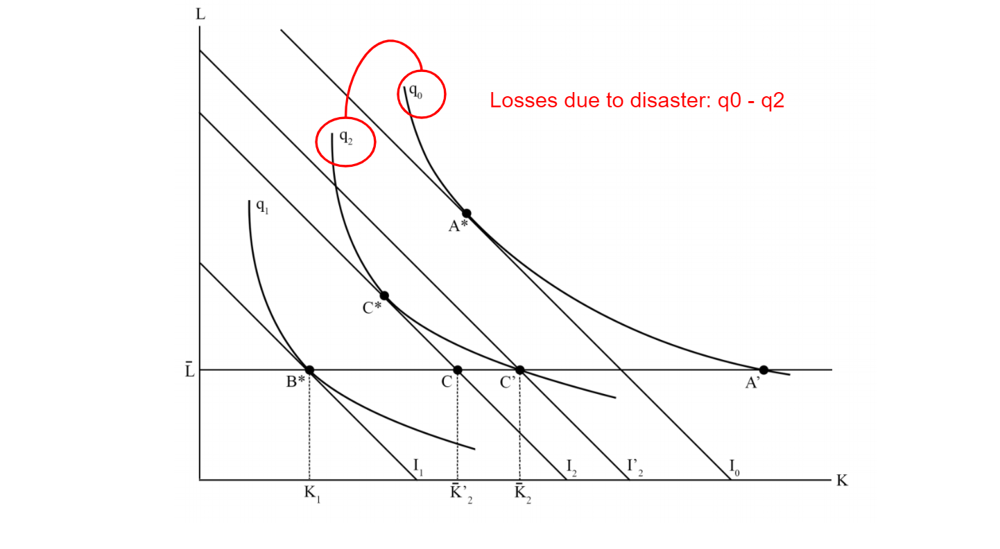

```{r setup, include=FALSE}

knitr::opts_chunk$set(echo = FALSE, warning = FALSE, message = FALSE)

library(tidyverse)
library(ggridges)
library(haven)
library(plotly)
library(png)
library(knitr)

```

# Overview

* **Research Question:** Are businesses more/less resilient to certain infrastructure disruptions?
  * I.e., Are losses from some disruption types more/less avoidable?

* **Who cares?** 
  * Policy makers, city planners, disaster managers, individual firms

* **Data** 
  * Survey from firms affected by Hurricane Harvey

* **Contributions**
  * Resilience measurement 
  * Empirical framework to guide further research


---

# What is resilience?

* Ability of a system to absorb shocks
  * Focus on the **bounce-back** to normal or a "new" normal 

* Economic Resilience:
  * Focus on actions that occur after an event with the goal of reducing business interruptions (BI)
  * *Efficient* use of remaining resources


---

# Business Interruption (BI) versus Property Damage (PD)

* **September 11 World Trade Center Attacks**
  * PD: $25 billion
  * BI: $100 billion

* **Hurricane Katrina**
  * PD: $75 billion
  * BI: >$100 billion

* **ShakeOut San Andreas Fault Earthquake Simulation**
  * PD: $100 billion
  * BI: $68 billion

---

# Resilience Measurement

```{r, fig.retina=2}


```

---

# Resilience Measurement

```{r, fig.retina=2}

include_graphics("b.png")

```

---

# Resilience Measurement

```{r, fig.retina=2}

include_graphics("c.png")

```

---

# Resilience Measurement

```{r, fig.retina=2}


```

---

# Resilience Measurement

```{r, fig.retina=2}

include_graphics("e.png")

```

---

# Resilience Measurement

```{r, fig.retina=2}

include_graphics("f.png")

```

---

# Resilience Measurement

```{r, fig.retina=2}

include_graphics("g.png")

```

---

# Resilience Measurement

```{r, fig.retina=2}



```

---

# Resilience Measurement

* Majority of studies use these observed losses ( $q_0 - q_2$ ) as a resilience metric

  * All else equal, a system with less observed losses is more resilient. However, the comparison only gives us a *marginal* resilience.
  
  * In other words, some rebounding has already occured.
  
  * Only looking at losses misses some of the rebound
  
  * **Percent lost sales revenue (SR) metric:**

$$\% LostSR = \frac{E[SR_{No Disaster}] - SR_{Observed}}{E[SR_{NoDisaster}]}$$
---

# Resilience Measurement

```{r, fig.retina=2}

include_graphics("i.png")

```

---

# Resilience Measurement

* Want a metric that captures the full rebound

* **Resilience Metric = Percent of maximum losses that were avoided:**

$$RM = \frac{AvoidedLosses}{MaxPotential}$$
---

# Resilience Measurement

```{r, fig.retina=2}


```

---

# Resilience Measurement

* Caveat: Not all RMs are equal

  * Treats firms with high potential losses the same as firms with low potential losses

* Can weight (**w**) by the percent of sales revenue at risk:

$$w = \frac{MaxPotential}{E[SR_{NoDisaster}]}$$

* $w=1$ when entire SR is at risk
* $w\to0$ when SR is not at risk

---

# Resilience Measurement

* Weighting the RM (**wRM**) yields: 

$$wRM = w*RM = \frac{MaxPotential}{NoDisasterSR} * \frac{AvoidedLosses}{MaxPotential} = \frac{AvoidedLosses}{NoDisasterSR}$$
---

# Resilience Measurement

```{r, fig.retina=2}


```

---